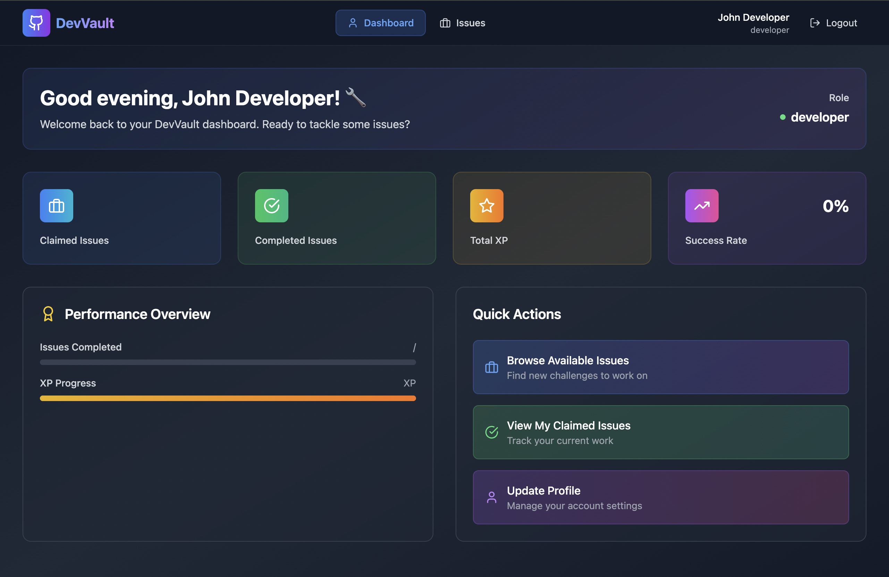

# 🚀 DevVault – GitHub Issue Marketplace (Frontend)

DevVault is a full-stack web application where developers can browse, claim, and get rewarded for solving real GitHub issues.  
This repository contains the **frontend** built with **React + Vite + TailwindCSS**.

---

## 📸 Preview



---

## 🛠️ Tech Stack

- ⚛️ React
- ⚡ Vite
- 💅 Tailwind CSS
- 🔐 JWT Auth (mocked for now)
- ☁️ Will connect to Spring Boot backend

---

## 📦 Getting Started

### 1. Clone the Repo

```bash
git clone https://github.com/Sujal-781/devvault-frontend.git
cd devvault-frontend
